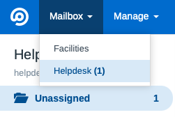

# FreeScout Unassigned Count Module
[FreeScout](https://github.com/freescout-helpdesk/freescout "FreeScout") Module to display the number of unassigned conversations in the Mailbox menu.

## Screenshot

## Changes
* [Number of unassigned conversations in the Mailbox menu](Providers/UnassignedCountServiceProvider.php#L37-L54)

## Install
1. Navigate to your Modules folder e.g. `cd /var/www/html/Modules`
2. Run `git clone https://github.com/avenjamin/freescout-UnassignedCount-Module.git UnassignedCount`
3. Run `chown -R www-data:www-data UnassignedCount` (or whichever user:group your webserver uses)
4. Activate the Module in the FreeScout Manage > Modules menu.

## Update
1. Navigate to the Unassigned Count Module folder e.g. `cd /var/www/html/Modules/UnassignedCount`
2. Run `git pull`
3. Run `chown -R www-data:www-data UnassignedCount` (or whichever user:group your webserver uses)
4. Enjoy the update!

## Known Issues
* ~~Requires at least 2 mailboxes to be created before the Mailbox menu appears~~ Fixed in FreeScout v1.8.68

